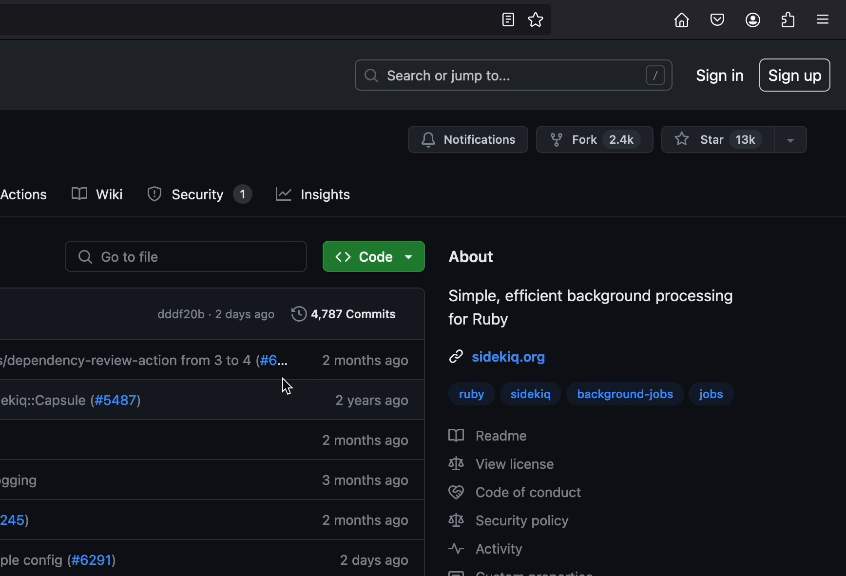
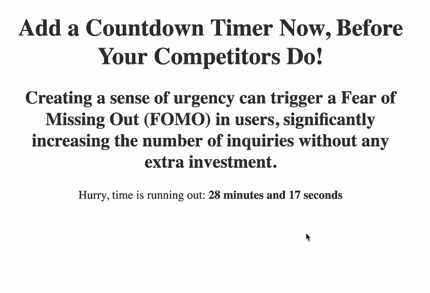
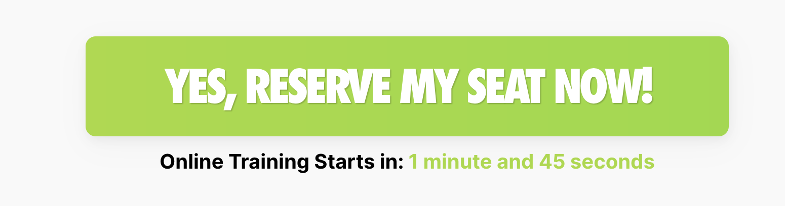

# How to Create a Sense of Urgency on Your Website to Boost Sales?

Creating a sense of urgency can instill a Fear Of Missing Out (FOMO) in users, significantly increasing the number of inquiries without any extra investment.

One way to do this is by using a countdown timer. Show how much time is left until the end of the promotion. This visual cue encourages quick decision-making.

I’ve created a timer that you can add to your website right now. Instructions and examples is here.

Add the timer to your site right now to get ahead of your competitors!

## How to Install?
To use the countdown timer, follow these steps:
1. Download the repository to your local machine.

2. Open the `main.html` file from `examples` folder in your in notepad/text editor.
3. Copy and paste the following HTML code to any place in your HTML page/website where you want the countdown timer to appear: ``
4. Customize the data-countdown-timer attribute value to set the desired countdown duration in seconds.
5. Copy the `` and paste it before the closing `</body>` tag.
6. Save your changes and refresh the web page to see the countdown timer in action.

Feel free to adjust the instructions based on your specific project structure or requirements!

For support and questions: [Andpeople - Digital Marketing Agency](https://andpeople.net/)

## Examples

For example, you can do this option. To do this, you will need to make changes to the styles (CSS) yourself.

